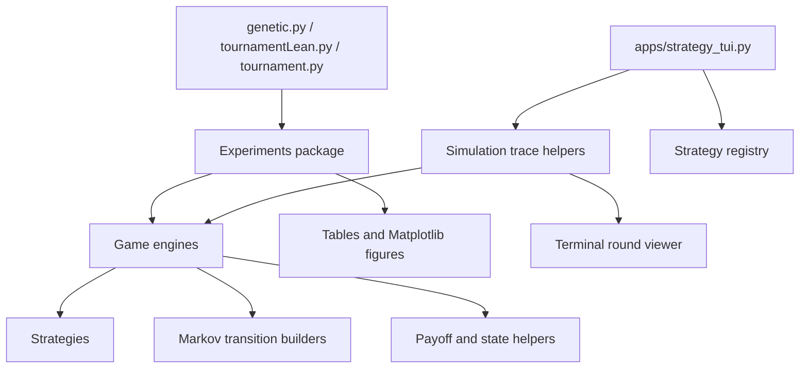
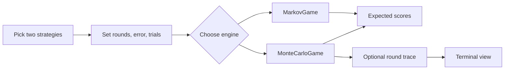

# Dilemma Dynamics

## A Game Theory Study of Evolutionary Cooperation

**Author: Joshua Chua Han Wei**

---

`Dilemma Dynamics` is a personal research project for studying strategy
selection, memory, noise, and cooperation in the Iterated Prisoner's Dilemma.
It combines Markov-chain scoring, Monte Carlo simulation, chromosome strategies,
and evolutionary selection experiments in one local workflow.

## 1  Project layout

- `Game/`: Markov and Monte Carlo game engines.
- `Markov/`: transition-matrix builders for memory sizes 1 to 3.
- `Strategies/`: hand-written strategies and chromosome strategies.
- `Experiments/`: shared tournament setup and runners.
- `Simulation/`: round-by-round trace helpers.
- `apps/`: small user-facing tools, including the terminal viewer.
- `Utils/`: payoff, state, plotting, and random seed helpers.
- `Test/`: pytest coverage for games, strategies, traces, and tools.
- `docs/`: notes on future visualization work.
- `genetic.py`: evolutionary cooperation experiment.
- `tournamentLean.py`: noise sensitivity experiment.
- `tournament.py`: full round-robin analysis driver.

Every package folder contains an `__init__.py`, so imports such as
`from Game.game import MarkovGame` work from the project root.

---

## 2  Architecture charts

These Mermaid charts show the current structure without adding any new runtime
dependency. GitHub can render them directly in this README.

### Main code layout



### Single matchup flow



The TUI is enough for checking one game round by round. For bigger questions,
such as tournament heatmaps or evolutionary takeover over many generations, the
Matplotlib plots are still more useful. A small Streamlit dashboard would be the
next step if you want an interactive GUI later.

---

## 3  Quick-start - reproduce analysis figures

```bash
# 1) create a fresh environment (Python >= 3.10)
python -m venv venv
source venv/bin/activate          # Windows: venv\Scripts\activate

# 2) install dependencies
pip install -r requirements.txt

# 3) generate the main analysis plots
python genetic.py          # takes about an hour
python tournamentLean.py   # takes about 5 to 10 minutes
```

Figures appear in Matplotlib windows **and** `./figures/`.

---

## 4  File-by-file guide

| File | Purpose | Typical runtime |
| --- | --- | --- |
| `genetic.py` | Runs 15 replicates across 8 evolutionary variants. Outputs cooperation, fitness, fixation, ECDF, and hazard plots. | about 75 s |
| `tournamentLean.py` | Runs a Monte Carlo noise sweep at 0 percent, 5 percent, and 10 percent error. Outputs performance and class-gap plots. | about 60 s |
| `tournament.py` | Runs the full round-robin strategy comparison. | 20 to 120 s |
| `apps/strategy_tui.py` | Shows one matchup round by round in the terminal. | < 2 s |
| `Utils/test.py` | Quick check for deterministic vs Monte Carlo payoffs. | < 2 s |

---

## 5  Performance awareness

| Component | Complexity | Design choice and impact |
| --- | --- | --- |
| **Markov builders** | O(4^m) states, which is 64 x 64 when m = 3. | The project caps m at 3 to keep transition matrices manageable. |
| **Monte Carlo engine** | O(trials x rounds). The default is 10,000 x 50. | Trials can be lowered for quick checks. |
| **Evolutionary simulator** | O(GEN x POP x (POP - 1) / 2 x match cost). | The default population is small enough for local runs. |
| **Memory footprint** | Peak RAM is about 130 MB. | Comfortable for normal local analysis runs. |

---

## 6  Running your own matches

```python
from Game.game import MarkovGame, MonteCarloGame
from Strategies.m1strategies import TitForTat, WinStayLoseShift

# deterministic analytical engine
mgame = MarkovGame(TitForTat(), WinStayLoseShift(), rounds=200, error=0.03)
score_A, score_B, _ = mgame.run()
print(score_A, score_B)
```

To add a custom strategy, subclass `Strategies.strategy.Strategy` and implement:

- `next_move(history, state_matrix)` returns `'C'` or `'D'`.
- `move_probabilities(history, state_matrix)` returns `{"C": p_c, "D": p_d}`.

---

## 7  Verification hooks

- `genetic.py` runs `verification_test()` before the main experiment to check population invariance when mu = 0, k = 0.
- `Utils/test.py` reproduces quick deterministic vs Monte-Carlo pay-off checks in < 2 s.
- `Test/` contains unittest coverage for Markov dynamics, chromosome conversion, memory strategies, and result symmetry.

## 8  Visualization roadmap

See `docs/visualization_roadmap.md` for a proposed path toward an interactive
research dashboard and round-by-round simulation viewer.

For a dependency-free round-by-round trace:

```bash
python apps/strategy_tui.py --strategy-a TitForTat --strategy-b AlwaysDefect --rounds 12
```

---

This framework is intended for reproducible computational experiments in
evolutionary game dynamics.
