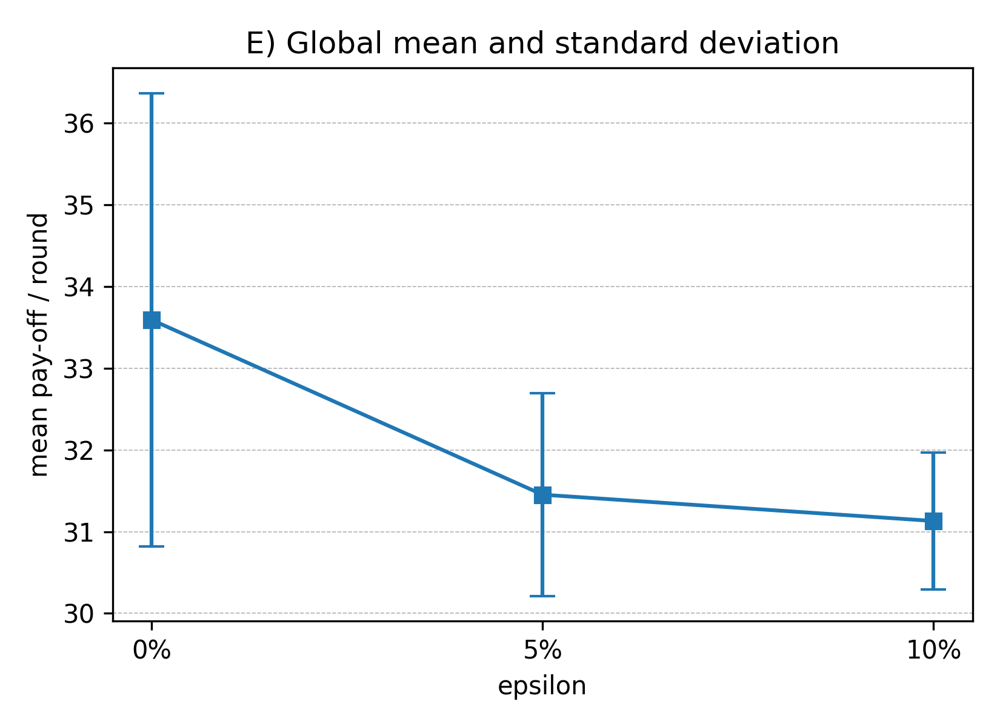
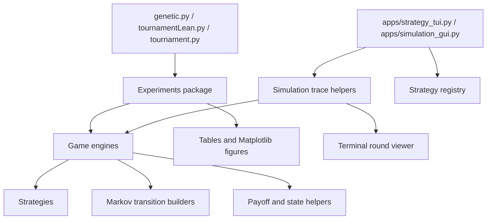
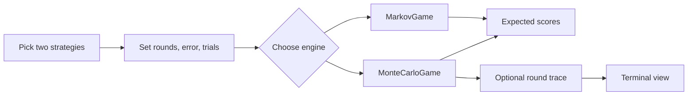

# Dilemma Dynamics



## A Game Theory Study of Evolutionary Cooperation

`Dilemma Dynamics` is a personal research project for studying strategy
selection, memory, noise, and cooperation in the Iterated Prisoner's Dilemma.
It combines Markov-chain scoring, Monte Carlo simulation, chromosome strategies,
and evolutionary selection experiments in one local workflow.

The goal is to compare how different decision rules behave under repeated
interaction. The project asks simple questions:

- Which strategies cooperate, exploit, or recover after mistakes?
- How does memory change performance?
- How does noise affect stable cooperation?
- Can evolutionary selection push a population toward cooperation?

## 1  Architecture

The code is split into strategy definitions, game engines, experiments, and
visual tools. The diagrams below show how the pieces connect.

### Main code layout



### Single matchup flow



The terminal view is enough for checking one game round by round. The desktop
GUI is better for watching pairwise simulations and live round-robin rankings.
The batch scripts still handle larger experiments and saved figures.

---

## 2  Run It

```bash
# 1) create a fresh environment (Python >= 3.10)
python -m venv venv
source venv/bin/activate          # Windows: venv\Scripts\activate

# 2) install dependencies
pip install -r requirements.txt

# 3) open the desktop simulator
python apps/simulation_gui.py
```

The GUI has two tabs:

- `Pairwise simulation`: watch one strategy matchup round by round.
- `Round robin`: run many strategies against each other and watch live score
  bars plus rankings update after each pairing.

---

## 3  Other Commands

For a dependency-free round-by-round trace:

```bash
python apps/strategy_tui.py --strategy-a TitForTat --strategy-b AlwaysDefect --rounds 12
```

For the full round-robin script:

```bash
python tournament.py
```

For the noise sensitivity study:

```bash
python tournamentLean.py
```

For the evolutionary experiment:

```bash
python genetic.py
```

Figures are saved in `./figures/`.
